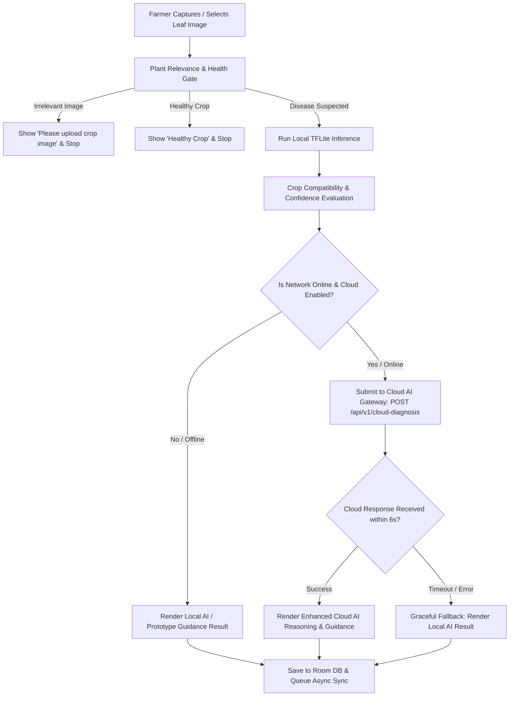

# AgriX — Stage 12: Cloud AI Architecture & API Contract Specification

**Document Version:** 1.0.0  
**Project:** AgriX Smart Agricultural Intelligence Platform  
**Target Repository:** `D:\SIH`  
**Companion Backend:** `D:\SIH\backend`  
**Status:** ARCHITECTURE & CONTRACT SPECIFICATION (Pre-Implementation)

---

## 1. Executive Summary & Core Architectural Principle

The AgriX platform is built on a strict **Offline-First, Cloud-Enhanced** paradigm. On-device intelligence via TensorFlow Lite (`agrix_stage2_fp16.tflite`) serves as the **authoritative first-line diagnostic engine**, guaranteeing that smallholder farmers can diagnose crop diseases in remote rural fields without cellular connectivity or cloud dependencies.

**Cloud AI** is designed exclusively as a **secondary, opt-in reasoning layer** that provides deeper multimodal validation, visual symptom explanations, and localized agronomic guidance when internet connectivity is active.

```
┌─────────────────────────────────────────────────────────────────────────────┐
│                          AGRIX HYBRID AI HIERARCHY                          │
├─────────────────────────────────────────────────────────────────────────────┤
│                                                                             │
│   PRIMARY (100% Offline / Mandatory):                                       │
│   ┌─────────────────────────────────────────────────────────────────────┐   │
│   │ On-Device TFLite (71 classes / 29 crops) + Crop Gating + Advisory   │   │
│   │ • Sub-100ms latency • Zero network dependency • 100% offline        │   │
│   └─────────────────────────────────────────────────────────────────────┘   │
│                                      │ (When network is available &         │
│                                      │  extended reasoning is requested)    │
│                                      ▼                                      │
│   SECONDARY (Cloud-Enhanced / Gracefully Degraded):                         │
│   ┌─────────────────────────────────────────────────────────────────────┐   │
│   │ FastAPI Companion Gateway -> Multi-Provider Multimodal Vision AI   │   │
│   │ • Deeper lesion reasoning • Agronomic explanation • 6 Languages     │   │
│   └─────────────────────────────────────────────────────────────────────┘   │
│                                                                             │
└─────────────────────────────────────────────────────────────────────────────┘
```

---

## 2. Comprehensive Repository Architecture Audit

### 2.1 Android Client Architecture (`D:\SIH\app`)
- **UI Framework:** Jetpack Compose with Material 3 design tokens, responsive cards, and dynamic localization.
- **On-Device Inference Pipeline:**
  1. `PlantRelevanceAssessor`: Color space gating (HSV/EGI) to reject non-plant images (laptops, phones, objects, faces).
  2. `Health Assessment Gate`: High-confidence vegetative leaf detector separating healthy foliage from diseased canopies.
  3. `TflitePlantDiseaseClassifier`: Preprocesses bitmaps to `[1, 224, 224, 3]` float32 normalized to `[-1, 1]`, runs `agrix_stage2_fp16.tflite`, producing 71 softmax probabilities.
  4. `Crop-Aware Gating`: Filters top predictions against 29 supported crops and 71 disease classes (`crop_disease_map.json`, `agrix_label_map.json`).
  5. `DemoPrototypeDiagnosisEngine`: Deterministic fallback mechanism for 5 demo crops (Tomato, Chilli, Rice, Wheat, Sugarcane) when out-of-distribution leaf samples enter demonstration flows.
- **Persistence Layer:** Room Database (`AgriXDatabase` v3) managing `farm_profile` and `diagnosis_records` entities with migration scripts `MIGRATION_1_2` and `MIGRATION_2_3`.
- **Offline Synchronization:** `DiagnosisRepository` logs diagnosis events with `SyncStatus.PENDING` and asynchronously pushes to FastAPI when connectivity is established.
- **Localization:** 6 supported regional languages (`en`, `hi`, `te`, `ta`, `kn`, `ml`).

### 2.2 Companion Backend Architecture (`D:\SIH\backend`)
- **Web Framework:** FastAPI (Python 3.13) running asynchronous ASGI with Uvicorn.
- **Existing Endpoints:**
  - `GET /`, `GET /health`, `GET /api/v1/system/status` (Health & system metrics)
  - `GET /api/v1/crops`, `GET /api/v1/crops/{crop_id}` (29 supported crops)
  - `GET /api/v1/diseases` (71 supported diseases)
  - `POST /api/v1/diagnoses`, `GET /api/v1/diagnoses`, `GET /api/v1/diagnoses/{id}` (Diagnosis persistence & synchronization)
  - `POST /api/v1/advisories`, `GET /api/v1/advisories`, `GET /api/v1/advisories/{crop_id}` (7-Section agronomic advisories)
- **Data Models:** Pydantic v2 schemas (`DiagnosisCreateRequest`, `DiagnosisResponse`, `AdvisoryResponse`, `CropRef`, `DiseaseRef`, `DiagnosticStatusEnum`).
- **Repositories:** `DiagnosisRepository`, `AdvisoryRepository`, `MetadataRepository` referencing `agrix_advisory_catalog.json` (71 verified advisories).

---

## 3. Hybrid Routing & Decision Workflow

The routing engine ensures that the application responds immediately on-device while offering cloud enhancement where beneficial and available.



### Routing Rules:
1. **Offline Mode:** If network connectivity is unavailable, on-device inference (`REAL_TFLITE` or `DEMO_PROTOTYPE`) is displayed immediately.
2. **High Confidence Local AI:** If local TFLite confidence is $\ge 0.75$ and crop-compatible, local AI is displayed instantly. A non-blocking background query or user-initiated "Deep AI Inspection" can be triggered.
3. **Low / Moderate Confidence Local AI:** If network connectivity is available, the client queries `POST /api/v1/cloud-diagnosis` with a 6-second timeout.
4. **Cloud AI Failure / Timeout:** Any cloud error, timeout, rate limit, or invalid response instantly defaults to the on-device diagnostic result with zero UI freezes, zero exceptions, and zero user disruption.

---

## 4. Cloud AI API Contract Specification

### 4.1 Endpoint Definition
- **Route:** `POST /api/v1/cloud-diagnosis`
- **Content-Type:** `multipart/form-data`
- **Authentication:** Optional client bearer token / API key header (extensible, non-blocking for prototype).
- **Rate Limit:** 30 requests/minute per client IP.

### 4.2 Request Schema (`multipart/form-data`)

| Parameter | Type | Required | Description | Example |
|---|---|---|---|---|
| `image` | Binary File | **Yes** | JPEG / PNG / WEBP leaf image (Max 4MB) | `leaf_photo.jpg` |
| `crop_id` | String (Form) | **Yes** | Standardized crop identifier matching AgriX metadata | `tomato` |
| `local_disease_id` | Integer (Form) | Optional | Local TFLite predicted class ID (0..70) | `54` |
| `local_disease_name`| String (Form) | Optional | Local predicted disease name | `Tomato Early Blight` |
| `local_confidence` | Float (Form) | Optional | Local confidence score (0.00 to 1.00) | `0.62` |
| `local_status` | String (Form) | Optional | Local diagnostic status enum value | `MODERATE_CONFIDENCE` |
| `language` | String (Form) | Optional | Target output language code (`en`, `hi`, `te`, `ta`, `kn`, `ml`) | `hi` |
| `soil_type` | String (Form) | Optional | Farmer profile soil context | `Black` |
| `state` | String (Form) | Optional | Farmer region context for localized advisory | `Maharashtra` |
| `district` | String (Form) | Optional | Farmer district context | `Pune` |

### 4.3 Response Schema (`application/json`)

```json
{
  "status": "success",
  "provider": "gemini-1.5-flash",
  "latency_ms": 1420,
  "diagnosis": {
    "crop": {
      "id": "tomato",
      "name": "Tomato"
    },
    "disease": {
      "id": 54,
      "name": "Tomato Early Blight"
    },
    "confidence": 0.94,
    "diagnostic_status": "CONFIDENT",
    "is_crop_compatible": true
  },
  "visual_reasoning": "Concentric dark brown rings with target-like patterns and chlorotic yellow halos observed on lower foliage, characteristic of Alternaria solani fungal infection.",
  "advisory": {
    "severity": "moderate",
    "urgency": "prompt",
    "overview": "Early blight is a prevalent fungal disease affecting tomato foliage, stems, and fruit.",
    "symptoms": [
      "Dark brown circular spots with concentric rings (target pattern)",
      "Yellowing (chlorosis) of surrounding leaf tissue",
      "Premature leaf drop starting from lower older leaves"
    ],
    "immediate_actions": [
      "Prune and remove infected lower leaves using clean shears",
      "Avoid overhead sprinkler irrigation; direct water to soil base",
      "Dispose of pruned infected foliage away from the field; do not compost"
    ],
    "prevention": [
      "Implement a 2- to 3-year crop rotation with non-solanaceous crops",
      "Apply organic mulch around plant bases to prevent soil splashing",
      "Maintain adequate plant spacing (60cm x 45cm) for optimal air circulation"
    ],
    "monitoring": [
      "Scout lower canopy leaves twice weekly during warm, humid conditions",
      "Inspect new vegetative growth for upward disease spread"
    ],
    "expert_escalation": "If lesions spread to more than 25% of canopy foliage, consult your nearest Krishi Vigyan Kendra (KVK) or Block Agriculture Officer.",
    "safety_note": "Practice integrated pest management. Follow recommended non-chemical cultural practices. Always consult local agricultural university guidelines before applying any crop protection measures."
  }
}
```

### 4.4 Error Response Schema (`application/json`)

```json
{
  "status": "error",
  "error_code": "IMAGE_UNRECOGNIZED",
  "message": "The uploaded image does not contain identifiable crop foliage.",
  "fallback_to_local": true,
  "local_diagnosis_retained": {
    "crop_id": "tomato",
    "disease_id": 54,
    "diagnostic_status": "MODERATE_CONFIDENCE"
  }
}
```

---

## 5. Provider Abstraction Architecture

To avoid vendor lock-in and ensure modular extensibility, the FastAPI backend will implement a generic provider interface.

```
┌──────────────────────────────────────────────────────────────────┐
│                   CloudDiagnosisProvider (ABC)                   │
├──────────────────────────────────────────────────────────────────┤
│ + diagnose(request: ProviderDiagnosisRequest): ProviderResponse  │
│ + is_healthy(): bool                                             │
└──────────────────────────────────────────────────────────────────┘
                                ▲
                                │
        ┌───────────────────────┴───────────────────────┐
        │                                               │
┌───────────────────────────────┐               ┌───────────────────────────────┐
│     GeminiDiagnosisProvider   │               │     MockDiagnosisProvider     │
│ (Google Gemini 1.5 Flash API) │               │ (CI / Automated Testing Mock) │
└───────────────────────────────┘               └───────────────────────────────┘
```

### Python Interface Specification (`app/services/cloud_ai/provider.py`):
```python
from abc import ABC, abstractmethod
from pydantic import BaseModel
from typing import List, Optional

class ProviderDiagnosisRequest(BaseModel):
    image_bytes: bytes
    mime_type: str
    crop_id: str
    local_disease_id: Optional[int] = None
    local_confidence: Optional[float] = None
    local_status: Optional[str] = None
    language: str = "en"
    state: Optional[str] = None
    district: Optional[str] = None

class ProviderDiagnosisResponse(BaseModel):
    crop_id: str
    crop_name: str
    disease_id: int
    disease_name: str
    confidence: float
    status: str
    visual_reasoning: str
    symptoms: List[str]
    immediate_actions: List[str]
    prevention: List[str]
    monitoring: List[str]
    expert_escalation: str
    safety_note: str
    provider_name: str

class CloudDiagnosisProvider(ABC):
    @abstractmethod
    async def diagnose(self, request: ProviderDiagnosisRequest) -> ProviderDiagnosisResponse:
        pass

    @abstractmethod
    async def is_available(self) -> bool:
        pass
```

---

## 6. Security, Configuration & Secret Management

1. **Zero Client Secrets:** No cloud API keys or AI credentials shall ever be embedded in the Android APK, Gradle properties, or client-side assets.
2. **Backend Environment Configuration:** Cloud API keys will be managed exclusively via backend environment variables and `.env` files (e.g. `AGRIX_GEMINI_API_KEY` or `AGRIX_CLOUD_AI_KEY`).
3. **Safe Missing-Key Behavior:** If the cloud API key is absent or empty:
   - The backend service starts normally without crashing.
   - The `CloudDiagnosisProvider` marks its health as unavailable (`is_available() == False`).
   - The `/api/v1/cloud-diagnosis` endpoint returns an HTTP 503 status code with `fallback_to_local: true`, allowing Android to gracefully use on-device TFLite predictions.
4. **Git Protection:** `.env` and secret key patterns are explicitly listed in `.gitignore`.

---

## 7. Image Handling & Network Optimization

- **Accepted MIME Types:** `image/jpeg`, `image/png`, `image/webp`.
- **Client-Side Compression:**
  - Original camera capture images (4MB–15MB) are scaled down on-device to a maximum dimension of 1024x1024 pixels with 80% JPEG quality before upload.
  - Reduces average payload size from ~8MB to ~180KB, conserving 2G/3G/4G bandwidth for rural farmers.
- **MIME & Magic Byte Validation:** FastAPI validates file headers (`image/jpeg`, `image/png`, `image/webp`) prior to forwarding to cloud vision models.
- **Client Timeouts:**
  - Connect Timeout: 4,000ms.
  - Read Timeout: 6,000ms.
  - Total allowable cloud round-trip latency: 6,000ms maximum.

---

## 8. Agricultural Safety & Responsible AI Guardrails

To protect farmers from crop damage and inaccurate treatment:
1. **No Chemical Prescription Generation:** Cloud AI must **never** hallucinate specific chemical dosages, brand-name pesticides, or unregistered chemical formulations. All recommendations must adhere to standard Integrated Pest Management (IPM), cultural hygiene, and authorized university agricultural extension practices.
2. **Mandatory Safety Disclaimers:** Every cloud advisory payload must include a standard statutory disclaimer advising consultation with local Krishi Vigyan Kendras (KVK) or certified agricultural extension officers.
3. **Crop-Aware Isolation:** If an image labeled as `"Tomato"` shows symptoms of a `"Wheat"` rust, the cloud AI must detect and flag the crop anomaly rather than forcing an impossible diagnosis.
4. **Strict Certainty Boundaries:** If the image is blurry, ambiguous, or damaged, the cloud AI must return a moderate/low confidence or uncertain response rather than fabricating false 100% confidence.

---

## 9. Failure Modes & Graceful Degradation Matrix

| Failure Scenario | Backend Action | Android Client Action | Farmer Experience |
|---|---|---|---|
| **No Network / Airplane Mode** | None (Request not sent) | Routes to local TFLite classifier | Instant offline diagnosis with local advisory |
| **Backend Unreachable (502/504)** | None | Catch `IOException` $\to$ fallback | Local TFLite diagnosis displayed with offline badge |
| **Cloud API Rate Limited (429)** | Return HTTP 429 with fallback flag | Catch HTTP 429 $\to$ fallback | Local diagnosis displayed smoothly |
| **Cloud Provider Outage (500/503)** | Log warning, return 503 fallback | Catch HTTP 503 $\to$ fallback | Local diagnosis displayed smoothly |
| **Network Timeout (> 6000ms)** | Abort cloud request | Cancel coroutine $\to$ fallback | Local diagnosis displayed; no endless spinner |
| **Malformed / Invalid Image** | Return HTTP 400 with error details | Display "Please upload a clear crop image" | User prompted to retake photo |
| **Backend Missing API Key** | Return HTTP 503 with fallback flag | Gracefully fallback to local result | Local diagnosis displayed without disruption |

---

## 10. Privacy & Data Minimization

- **Minimal Data Transmission:** Only the leaf photo, selected crop name, and generalized administrative region (state/district) are transmitted.
- **Zero PII Exposure:** Farmer personal names, phone numbers, Aadhaar numbers, cadastral survey numbers, and exact GPS coordinates are **never** forwarded to third-party cloud AI providers.
- **Image Retention Policy:** Ephemeral processing on cloud AI vision pipelines; zero permanent image storage on third-party cloud servers.

---

## 11. Observability & Monitoring

- **Structured Backend Logging:**
  - Unique trace ID per request (`trace_id`).
  - Metadata logged: `crop_id`, `provider`, `latency_ms`, `http_status`, `confidence_band`.
  - Prohibited from logs: API keys, raw base64/image byte streams, and farmer personal identity.
- **Client-Side Diagnostics:** Android logs synchronization status and cloud enhancement latency to Logcat under the tag `AgriX_CloudAI`.

---

## 12. Test & Verification Plan (for Stage 13)

### Backend Automated Test Matrix
1. `test_cloud_diagnosis_success`: Valid image + crop returns 200 with complete diagnosis and 7-section advisory.
2. `test_cloud_diagnosis_missing_api_key`: Missing cloud key returns 503 with `fallback_to_local = true`.
3. `test_cloud_diagnosis_timeout_handling`: Simulated provider timeout triggers graceful degradation.
4. `test_cloud_diagnosis_invalid_mime`: Non-image file payload returns 400 Bad Request.
5. `test_cloud_diagnosis_crop_mismatch`: Validates crop consistency gating on cloud responses.
6. `test_provider_abstraction`: Mock provider swaps cleanly with production provider.

### Android Automated Test Matrix
1. `test_cloud_fallback_when_offline`: Offline network state uses local inference immediately.
2. `test_cloud_fallback_on_http_error`: Simulated 500/503 error falls back to on-device result.
3. `test_cloud_fallback_on_timeout`: Timeout after 6s falls back to on-device result without crash.
4. `test_cloud_enhanced_result_ui`: Valid cloud result populates enhanced visual reasoning and localized advisory.

---

## 13. Implementation Boundaries

### What WILL Be Implemented in Stage 13:
- Implementation of `POST /api/v1/cloud-diagnosis` route in FastAPI companion backend.
- Implementation of `CloudDiagnosisProvider` interface and concrete `GeminiDiagnosisProvider` / `MockDiagnosisProvider`.
- Backend `.env` configuration loader with safe missing-key handling.
- Android `HttpCloudAiClient` integration with `AiEngineRouter`.
- Automated test suites for all cloud success and fallback paths.

### What MUST NOT Be Changed from Stages 8–11:
- `agrix_stage2_fp16.tflite` model file and weights remain untouched.
- 71 disease classes and 29 crop metadata structures remain authoritative.
- Room database tables (`farm_profile`, `diagnosis_records`) and migrations remain intact.
- On-device inference, relevance gating, and offline advisory catalog remain 100% functional and offline-first.
- Stage 8 offline diagnosis synchronization contract remains intact.

---

**Report Prepared By:** AgriX AI Engineering Team  
**Verification Date:** 2026-08-26
